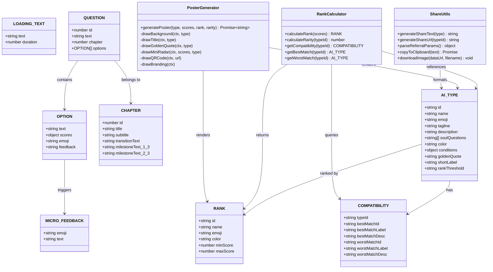
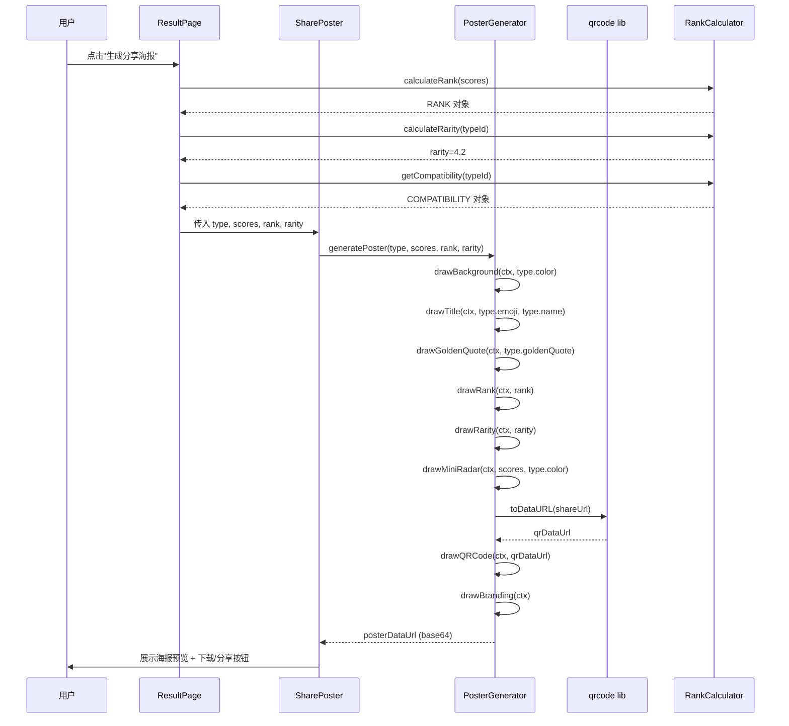
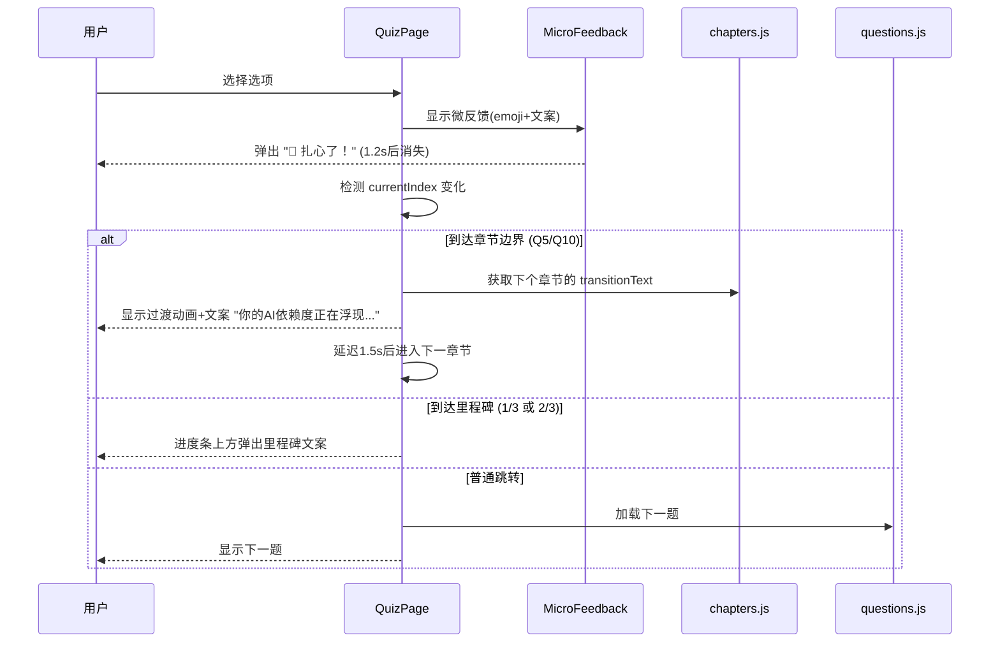
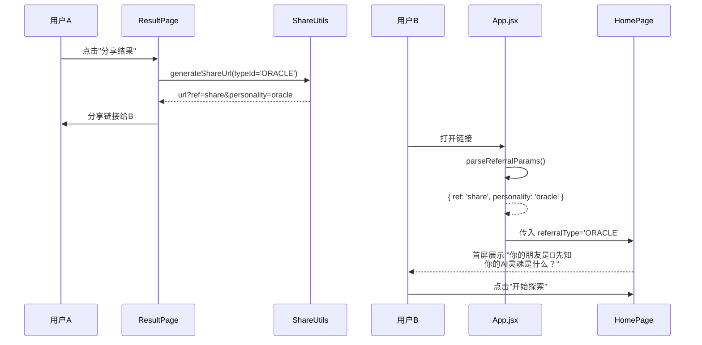
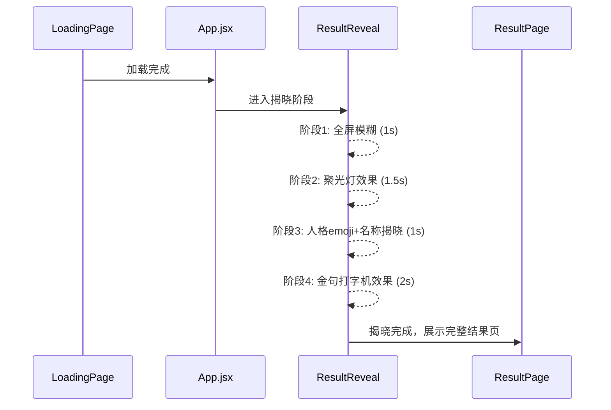
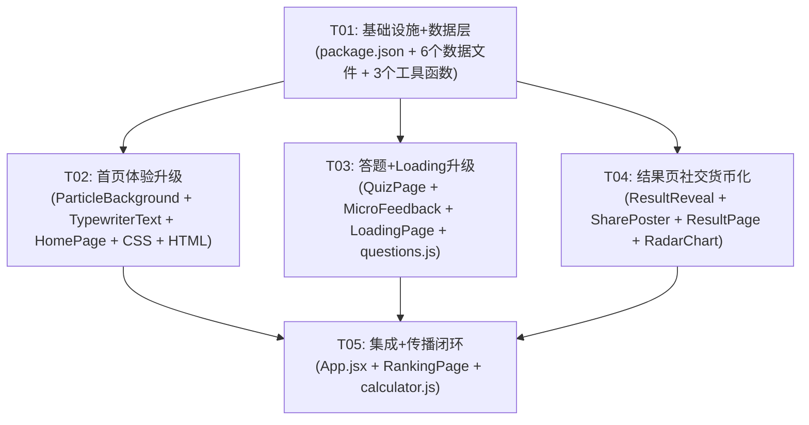

# AIR·AI段位实况 — 爆火优化系统架构设计

> **版本**: v1.0 | **日期**: 2026-05-19 | **架构师**: 高见远(Gao)

---

## Part A: 系统设计

### 1. 实现方案

#### 核心技术挑战

| 挑战 | 难度 | 解决方案 |
|------|------|----------|
| 分享海报生成（Canvas绘制高清图片） | ⭐⭐⭐ | 使用原生 Canvas API 逐元素绘制，避免 html2canvas 的 CSS 兼容性问题 |
| 动态粒子背景（性能+美观） | ⭐⭐ | 自定义 Canvas 粒子系统，限制粒子数量(≤50)，使用 requestAnimationFrame |
| 微信 OG 图（纯前端无法动态 meta） | ⭐⭐ | 预设通用 OG 标签 + URL 参数传递人格类型 + 首屏个性化展示 |
| 答题章节化（不破坏现有测试） | ⭐⭐ | 在 questions.js 增加 chapter 字段，QuizPage 检测章节边界，不改变数据结构核心 |
| 结果揭晓仪式感动画 | ⭐⭐ | CSS 模糊→清晰动画 + React state 控制动画阶段 |
| 打字机效果 | ⭐ | 自定义 React Hook，setInterval 逐字展示，无需外部库 |

#### 框架和库选型

| 类别 | 选型 | 理由 |
|------|------|------|
| 粒子背景 | **自定义 Canvas 实现** | 不引入重型库（tsparticles ~40KB），自定义实现仅 ~2KB，完全可控 |
| 分享海报 | **原生 Canvas API** | html2canvas 对 backdrop-filter 支持差、跨域图片问题多；原生 Canvas 可精确控制每个像素 |
| 二维码 | **qrcode@^1.5.3** | 轻量（~15KB），提供 `toDataURL()` 可直接嵌入 Canvas 海报 |
| 打字机效果 | **自定义 Hook** | 无需 react-typewriter 等库，20行代码即可实现 |
| 进度里程碑 | **React state + CSS** | 纯状态驱动，无需额外库 |
| 动画 | **CSS Keyframes + React state** | 不引入 framer-motion（~30KB），现有 CSS 动画体系已完善 |

**架构模式**：沿用现有的 **单页状态驱动模式**（App.jsx 管理页面状态 + 各页面组件自治），不引入 Router 或全局状态管理库，保持简洁。

#### 关键设计决策

1. **海报生成用 Canvas API 而非 html2canvas**
   - html2canvas 在暗色主题、毛玻璃效果、渐变文字等场景下渲染不一致
   - Canvas 逐元素绘制确保输出稳定可控，且可精确控制图片尺寸和 DPI

2. **粒子系统自定义实现**
   - tsparticles 功能强大但体积大，首屏加载时间不可接受
   - 自定义实现仅需 ~100 行代码，支持浮动 AI 符号 + 连线效果

3. **微信 OG 图用静态标签 + URL 参数**
   - 纯前端无法为微信爬虫动态生成 meta 标签
   - 替代方案：index.html 预设通用 OG 标签 + 结果页通过 URL hash 展示个性化内容
   - 长期方案：部署 12 个静态 HTML 入口（share/oracle.html 等），但本次不实现

4. **章节化改造向后兼容**
   - 为 questions 数组每项增加 `chapter` 字段（1/2/3）
   - 为 options 每项增加 `emoji` 和 `feedback` 字段
   - 不修改 `text` 和 `scores` 结构，确保 79 个测试用例不受影响

---

### 2. 文件列表

#### 新增文件

| 文件路径 | 说明 |
|----------|------|
| `src/data/ranks.js` | 段位等级定义（青铜→王者）+ 稀有度配置 |
| `src/data/compatibility.js` | 12人格兼容性矩阵（最佳搭档 + 最不合拍） |
| `src/data/chapters.js` | 3章节元数据 + 过渡文案 + 里程碑文案 |
| `src/data/microFeedback.js` | 答题即时反馈数据（emoji + 短文案池） |
| `src/data/loadingTexts.js` | Loading 页趣味文案轮播 |
| `src/utils/rankCalculator.js` | 段位计算 + 稀有度计算 + 兼容性查询 |
| `src/utils/posterGenerator.js` | Canvas 海报生成器（核心：绘制分享图） |
| `src/utils/shareUtils.js` | 分享文案生成 + 链接构建 + URL 参数解析 |
| `src/components/ParticleBackground.jsx` | 动态粒子背景组件 |
| `src/components/TypewriterText.jsx` | 打字机效果文本组件 |
| `src/components/SharePoster.jsx` | 分享海报容器（触发生成+下载） |
| `src/components/ResultReveal.jsx` | 结果揭晓仪式感动画组件 |
| `src/components/MicroFeedback.jsx` | 答题选择后微反馈弹窗组件 |

#### 修改文件

| 文件路径 | 修改内容 |
|----------|----------|
| `package.json` | 新增 qrcode 依赖 |
| `index.html` | 优化 OG 标签 + 添加 Twitter Card |
| `src/index.css` | 新增动画 keyframes（脉冲、模糊揭晓、反馈弹出等） |
| `src/data/types.js` | 每个类型增加 goldenQuote、shortLabel、rankThreshold 字段 |
| `src/data/questions.js` | 每题增加 chapter 字段；每个 option 增加 emoji、feedback 字段 |
| `src/App.jsx` | 新增 URL 参数解析（friend referral）、LoadingPage 传参 |
| `src/components/HomePage.jsx` | 重设计：粒子背景 + 打字机标题 + 动态计数 + 好友邀请文案 |
| `src/components/QuizPage.jsx` | 章节化 + 微反馈 + 里程碑 + 灵魂过渡 |
| `src/components/LoadingPage.jsx` | 趣味文案轮播 + 动效增强 |
| `src/components/ResultPage.jsx` | 段位标签 + 稀有度 + 搭档配对 + 揭晓动画 + 海报生成 + 分享优化 |
| `src/components/RankingPage.jsx` | 段位等级展示增强 |

---

### 3. 数据结构和接口



#### 核心数据结构定义

**ranks.js — 段位等级**
```javascript
const RANKS = [
  { id: 'bronze',   name: '青铜', emoji: '🥉', color: '#CD7F32', minScore: 0,  maxScore: 25 },
  { id: 'silver',   name: '白银', emoji: '🥈', color: '#C0C0C0', minScore: 26, maxScore: 45 },
  { id: 'gold',     name: '黄金', emoji: '🥇', color: '#FFD700', minScore: 46, maxScore: 60 },
  { id: 'platinum', name: '铂金', emoji: '💎', color: '#E5E4E2', minScore: 61, maxScore: 75 },
  { id: 'diamond',  name: '钻石', emoji: '💠', color: '#B9F2FF', minScore: 76, maxScore: 90 },
  { id: 'king',     name: '王者', emoji: '👑', color: '#FF6B6B', minScore: 91, maxScore: 100 },
];
```

**types.js — 新增字段**
```javascript
// 每个类型新增：
{
  // ... 现有字段 ...
  goldenQuote: '你已经在用AI预言未来，只是别人还不知道', // 扎心金句
  shortLabel: '先知',  // 短标签，用于分享文案
}
```

**compatibility.js — 兼容性矩阵**
```javascript
const COMPATIBILITY = [
  {
    typeId: 'ORACLE',
    bestMatchId: 'WIZARD',
    bestMatchLabel: '🤝 最强CP',
    bestMatchDesc: '一个看得远，一个做得精，AI界的双子星',
    worstMatchId: 'OSTRICH',
    worstMatchLabel: '😤 宿命对手',
    worstMatchDesc: '你信AI如神，他视AI如空气——鸡同鸭讲',
  },
  // ... 12组
];
```

**chapters.js — 章节定义**
```javascript
const CHAPTERS = [
  {
    id: 1,
    title: '第一层',
    subtitle: '你真的会用AI吗？',
    transitionText: '你的AI依赖度正在浮现...',
    milestoneText1_3: '刚热身 💫',
    milestoneText2_3: '灵魂拷问来了 👀',
  },
  // ... 3章节
];
```

**microFeedback.js — 即时反馈池**
```javascript
const FEEDBACK_POOL = [
  { emoji: '🎯', text: '扎心了！' },
  { emoji: '💡', text: '被说中了！' },
  { emoji: '😱', text: '这也太准了！' },
  { emoji: '🤔', text: '嗯……有道理' },
  { emoji: '😂', text: '笑出声了' },
  // ... 8-10 组
];
```

#### 核心接口

**rankCalculator.js**
```typescript
// 基于8维度总分计算段位
calculateRank(scores: Object): RANK
// 基于 localStorage 排行数据计算稀有度百分比
calculateRarity(typeId: string): number
// 获取某类型的兼容性数据
getCompatibility(typeId: string): COMPATIBILITY
```

**posterGenerator.js**
```typescript
// 生成分享海报，返回 base64 dataURL
generatePoster(type: AI_TYPE, scores: Object, rank: RANK, rarity: number): Promise<string>
```

**shareUtils.js**
```typescript
// 生成分享文案
generateShareText(type: AI_TYPE): string
// 生成带人格参数的分享 URL
generateShareUrl(typeId: string): string
// 解析 URL 中的好友推荐参数
parseReferralParams(): { ref?: string, personality?: string }
// 复制文本到剪贴板
copyToClipboard(text: string): Promise<void>
// 下载 base64 图片
downloadImage(dataUrl: string, filename: string): void
```

---

### 4. 程序调用流程

#### 4.1 分享海报生成流程



#### 4.2 答题章节化流程



#### 4.3 好友推荐（Friend Referral）流程



#### 4.4 结果揭晓仪式感流程



---

### 5. 待明确事项

| # | 事项 | 假设 | 影响范围 |
|---|------|------|----------|
| 1 | 段位计算公式 | 基于8维度总分平均值映射到段位等级 | rankCalculator.js |
| 2 | 稀有度数据来源 | 基于现有 getInitialRanking() 的 localStorage 数据计算百分比 | rankCalculator.js |
| 3 | 题目文案是否需要场景化改写 | 假设由产品经理提供改写版本，开发只负责结构改造 | questions.js |
| 4 | 12张 OG 分享图是否预生成 | 本次不预生成，使用通用 OG 标签 + URL 参数方案 | index.html |
| 5 | 音效反馈 | P1 需求，本次架构预留 but 不实现，后续可添加 Audio 组件 | — |
| 6 | 分享解锁"隐藏面"内容 | 需产品经理为每人格额外撰写深度解读，本次预留数据字段 | types.js |
| 7 | "已有X人测试"数字增长算法 | 基于 localStorage 存储基准数+时间戳递增模拟 | HomePage.jsx |
| 8 | 海报尺寸和 DPI | 按 750×1334px（2x iPhone 6/7/8）设计，Canvas 按 2x 渲染 | posterGenerator.js |

---

## Part B: 任务分解

### 6. 依赖包列表

```
- qrcode@^1.5.3: 二维码生成（轻量，提供 toDataURL 嵌入 Canvas 海报）
```

> **不引入的包及理由**：
> - `html2canvas`：对暗色主题+毛玻璃效果渲染不稳定，改用原生 Canvas
> - `tsparticles`：体积过大(~40KB)，自定义实现仅~2KB
> - `framer-motion`：体积~30KB，CSS 动画足以满足需求
> - `react-typewriter`：20行自定义 Hook 即可替代
> - `html-to-image`：与 html2canvas 同类问题

---

### 7. 任务列表

#### T01: 项目基础设施 + 数据层

**优先级**: P0 | **依赖**: 无

**说明**: 更新依赖、扩展数据结构、新建所有数据文件和工具函数。这是所有 UI 改造的基础。

**源文件**:
- `package.json` — 新增 qrcode 依赖
- `src/data/types.js` — 增加 goldenQuote、shortLabel 字段
- `src/data/ranks.js` — **新建** 段位等级定义
- `src/data/compatibility.js` — **新建** 12 人格兼容性矩阵
- `src/data/chapters.js` — **新建** 3 章节元数据 + 过渡/里程碑文案
- `src/data/microFeedback.js` — **新建** 答题即时反馈数据
- `src/data/loadingTexts.js` — **新建** Loading 页趣味文案
- `src/utils/rankCalculator.js` — **新建** 段位 + 稀有度 + 兼容性计算
- `src/utils/posterGenerator.js` — **新建** Canvas 海报生成器
- `src/utils/shareUtils.js` — **新建** 分享文案 + 链接 + 参数解析

**验收标准**:
- `npm install` 成功
- 所有新增数据文件可正常 import
- rankCalculator 所有函数返回正确结构
- posterGenerator 可生成 base64 图片
- shareUtils 可正确生成/解析 URL 参数
- 现有 79 个测试用例全部通过

---

#### T02: 首页体验升级

**优先级**: P0 | **依赖**: T01

**说明**: 重设计首页，实现粒子背景、打字机效果、动态计数、CTA 脉冲、好友邀请个性化入口。

**源文件**:
- `src/components/ParticleBackground.jsx` — **新建** Canvas 粒子背景
- `src/components/TypewriterText.jsx` — **新建** 打字机效果文本
- `src/components/HomePage.jsx` — 重设计：集成粒子+打字机+计数+邀请
- `src/index.css` — 新增动画 keyframes（脉冲呼吸、反馈弹出等）
- `index.html` — 优化 OG 标签 + Twitter Card

**验收标准**:
- 首屏 3 秒内渲染完成（粒子动画不影响加载）
- 打字机效果逐字揭示标题和金句
- 动态计数器持续递增
- CTA 按钮呼吸脉冲动画
- URL 带 `?personality=xxx` 参数时首屏展示好友邀请文案
- OG 标签包含标题、描述、类型

---

#### T03: 答题 + Loading 体验升级

**优先级**: P0 | **依赖**: T01

**说明**: 答题页章节化、微反馈、里程碑、灵魂过渡；Loading 页趣味文案轮播。

**源文件**:
- `src/data/questions.js` — 增加 chapter、emoji、feedback 字段
- `src/components/QuizPage.jsx` — 章节化 + 微反馈 + 里程碑 + 过渡动画
- `src/components/MicroFeedback.jsx` — **新建** 选择后即时反馈弹窗
- `src/components/LoadingPage.jsx` — 趣味文案轮播 + 动效增强

**验收标准**:
- 15 题分 3 章节，章节间显示过渡动画+文案
- 选择选项后弹出微反馈（emoji + 短文案），1.2s 后消失
- 进度条在 1/3、2/3 处显示里程碑文案
- Loading 页轮播 5+ 趣味文案
- 选项 emoji 前缀正确显示
- 现有 79 个测试用例不受影响（新增字段不破坏旧结构）

---

#### T04: 结果页社交货币化

**优先级**: P0 | **依赖**: T01

**说明**: 结果页段位标签、稀有度、搭档配对、揭晓动画、分享海报生成、分享优化。

**源文件**:
- `src/components/ResultReveal.jsx` — **新建** 揭晓仪式感动画（模糊→聚光灯→揭晓）
- `src/components/SharePoster.jsx` — **新建** 海报预览 + 下载/分享操作
- `src/components/ResultPage.jsx` — 集成段位+稀有度+配对+揭晓+海报+分享优化
- `src/components/RadarChart.jsx` — 适配迷你版（海报内绘制用）

**验收标准**:
- 结果页先显示揭晓动画（~4.5s），再展示完整内容
- 段位标签（青铜→王者）正确显示
- 稀有度百分比正确计算和显示
- 最佳搭档 + 最不合拍人格配对正确展示
- 点击"生成海报"可生成高清 Canvas 图片
- 海报包含：人格名+emoji、金句、段位、迷你雷达图、二维码、品牌标识
- 分享文案格式："我是🔮AI先知，你呢？测测你的AI段位→"
- 二维码可扫码跳转

---

#### T05: 集成 + 病毒传播闭环

**优先级**: P0 | **依赖**: T02, T03, T04

**说明**: App.jsx 集成好友推荐参数解析、页面间数据传递、排行榜段位增强、最终联调。

**源文件**:
- `src/App.jsx` — 好友推荐 URL 参数解析 + 页面状态集成
- `src/components/RankingPage.jsx` — 段位等级展示增强
- `src/utils/calculator.js` — 确保新增功能不影响现有导出

**验收标准**:
- URL 带 `?ref=share&personality=ORACLE` 打开时，首页显示邀请文案
- 完成测试后从 Loading → 结果揭晓 → 结果页 流畅过渡
- 排行榜页面展示段位等级标识
- 所有页面间导航正常
- 现有 79 个测试用例全部通过
- 端到端流程：首页→答题→加载→揭晓→结果→分享海报→下载 完整可用

---

### 8. 共享知识

```
- 所有新增数据文件使用 export default 导出，与现有 types.js/questions.js 保持一致
- 工具函数使用命名导出（named export），与现有 calculator.js 保持一致
- 所有颜色值使用 HEX 格式（#RRGGBB），与现有 types.js 保持一致
- 所有新增字段（goldenQuote, shortLabel, chapter, emoji, feedback）为可选字段，不影响现有逻辑
- Canvas 海报使用 2x DPI 渲染（750×1334 Canvas → 375×667 CSS 尺寸）
- 分享链接基础 URL 从 window.location.origin + vite base 拼接
- 稀有度百分比保留 1 位小数，如 "4.2%"
- 段位计算基于 8 维度平均分（不含正负偏移，纯 0-100 均值）
- 粒子背景使用 position:absolute + pointer-events:none 不影响交互
- 微反馈动画使用 CSS animation 不使用 JS 动画，确保 GPU 加速
- 所有动画时长控制在 4.5s 以内，避免用户等待不耐烦
- "已有X人测试"数字算法：基准 128847 + (当前时间戳 - 首次访问时间戳) / 3000 的整数部分
```

---

### 9. 任务依赖图



> **并行策略**：T02、T03、T04 均仅依赖 T01，可并行开发。T05 为最终集成，需等前三个任务完成。
